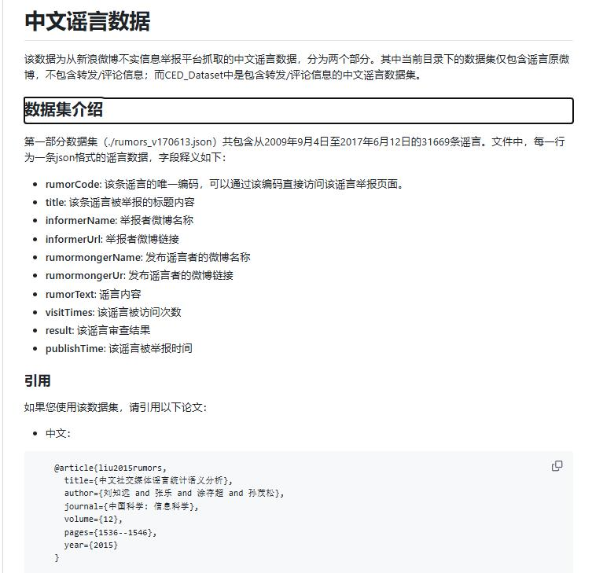
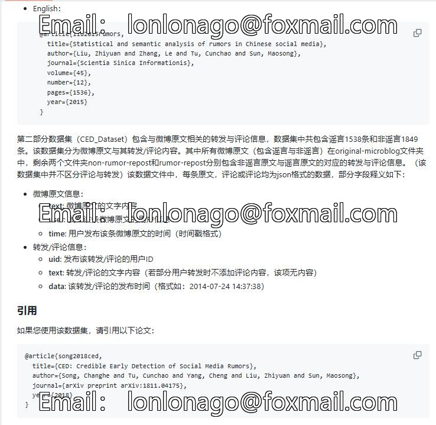

# Chinese Rumors and False News Dataset in JSON Format + Data Set Description Document

The Chinese Rumor and Fake News Data Set, in JSON format, includes a collection of Chinese news articles labeled as false or misleading. The dataset is designed to help researchers and students 
understand the characteristics of fake news in Chinese media and how they can be detected.

The dataset consists of three parts:
1. A list of 200 news articles from popular Chinese websites such as Sina Weibo, Tencent, and People's Daily Online.
2. An accompanying explanation document that explains the criteria for labeling an article as false or misleading.
3. A Python script that demonstrates how to use the dataset to detect fake news.

To use the dataset, you will need Python and the `json` module. Here is a sample code to load the data and perform a simple analysis:

```python
import json

def detect_fake_news(data):
    fake_news = []
    for item in data:
        if not item['label'] == 'true':
            fake_news.append(item)
    return fake_news

# Load the data
with open('chinese_news_dataset.json') as f:
    data = json.load(f)

# Perform analysis
fake_news = detect_fake_news(data)
print("False/Misleading News Articles:")
for news in fake_news:
    print(news)
```

This code will output the names of the false/misleading news articles found in the dataset. You can modify the script to include more complex analysis, such as sentiment analysis, topic modeling, or 
machine learning models trained on the dataset.
Image




Here is a pay link on Stripe ( https://buy.stripe.com/3cs8yP7sY87d0vu9AB ). Please contact me lonlonago@foxmail.com after funding $89, and I will send you a complete data files , thank you!

